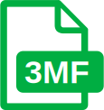

<!-- SPDX-License-Identifier: LGPL-2.1-or-later -->
<!-- markdownlint-disable MD029 MD033 MD041 -->

# Franky

Personal FreeCAD AddOn Workbench Version 0.2.17

## Features

This is a personal FreeCAD AddOn Workbench that provides some useful functions I need. It is specifically tailored to my personal preferences and needs. It is not intended for general use. However, I am sharing it in case it can be useful to others or inspire them to create their own custom workbenches.

The addon provides the following commands, available from the **Franky** toolbar and menu:

- **Export to STEP**: Exports the selected object(s) to STEP file(s) with a single click.
- **Export to STL**: Exports the selected object(s) to STL file(s) with a single click.
- **Export to 3MF**: Exports the selected object(s) to 3MF file(s) with a single click.
- **Export to IdeaMaker**: Exports the selected object(s) to STEP file(s) and opens them in IdeaMaker Slicer.
- **Export to Bambu Studio**: Exports the selected object(s) to STEP file(s) and opens them in Bambu Studio Slicer.
- **Export to Orca Slicer**: Exports the selected object(s) to STEP file(s) and opens them in Orca Slicer.
- **Screenshot**: Quickly capture a screenshot of the current view and save it as a PNG file.
- **Clipboard**: Quickly capture a screenshot of the current view and copy it to the clipboard.
- **VarSet Quick Editor**: Quickly edit and delete VarSets entries.
- **New Project**: Create a new project with predefined structure, body colors, and ordered object labels.

| Icon | Command | Description |
| :--: | ------- | ----------- |
|  | **Export to STEP** | Exports the selected object(s) to STEP file(s) with a single click. |
|  | **Export to STL** | Exports the selected object(s) to STL file(s) with a single click. |
|  | **Export to 3MF** | Exports the selected object(s) to 3MF file(s) with a single click. |
|  | **Export to IdeaMaker** | Exports the selected object(s) to STEP file(s) and opens them in IdeaMaker. |
|  | **Export to Bambu Studio** | Exports the selected object(s) to STEP file(s) and opens them in Bambu Studio. |
|  | **Export to OrcaSlicer** | Exports the selected object(s) to STEP file(s) and opens them in OrcaSlicer. |
|  | **Screenshot to File** | Capture a screenshot of the current view and save to PNG file. |
|  | **Screenshot to Clipboard** | Capture a screenshot of the current view and copy to Clipboard. |
|  | **VarSet Quick Edit** | Quickly edit and delete variable set entries. |
|  | **New Project** | Create a new project with predefined structure, body colors, and ordered object labels. |
